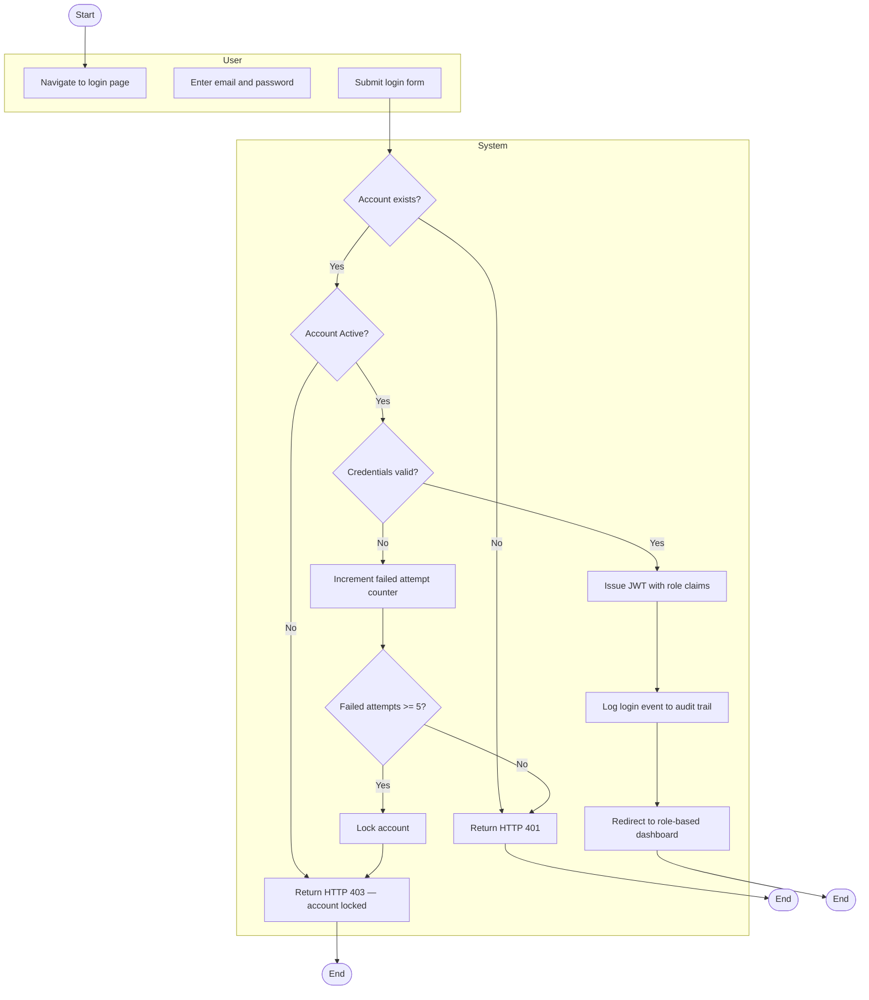
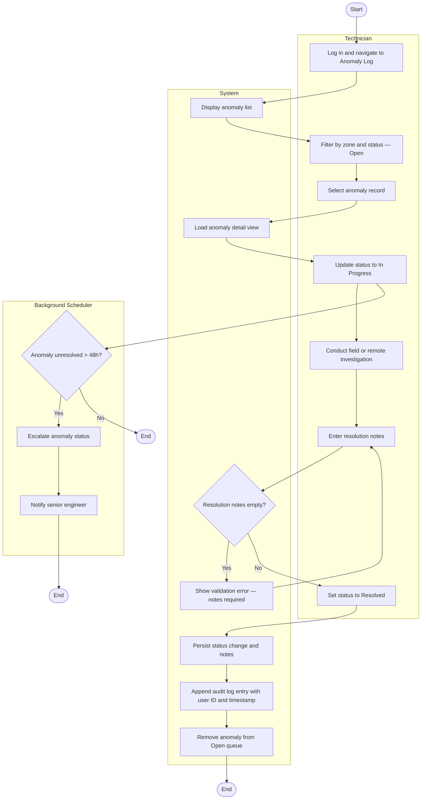
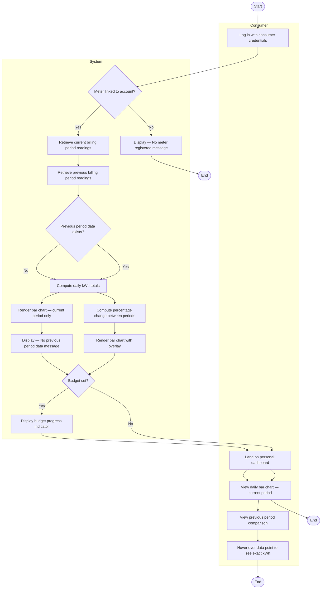
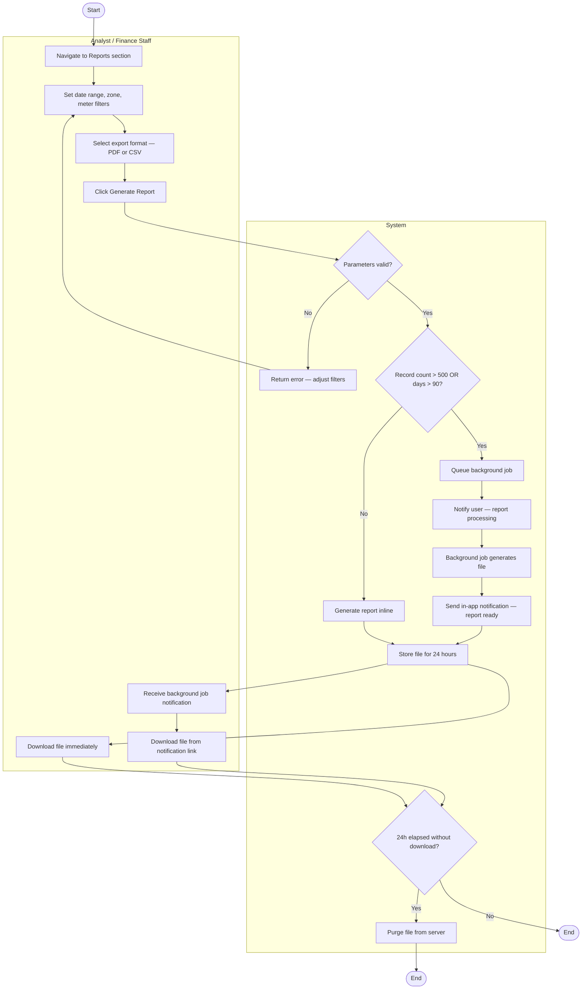
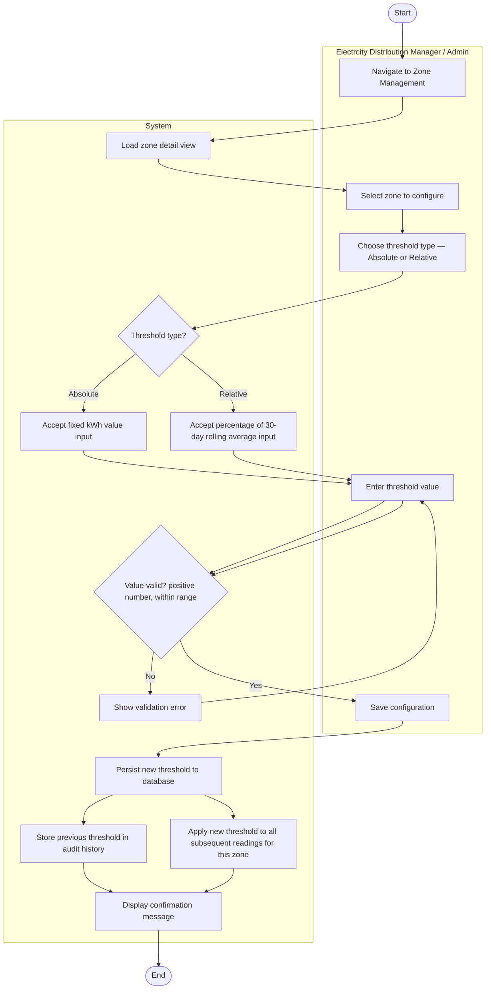
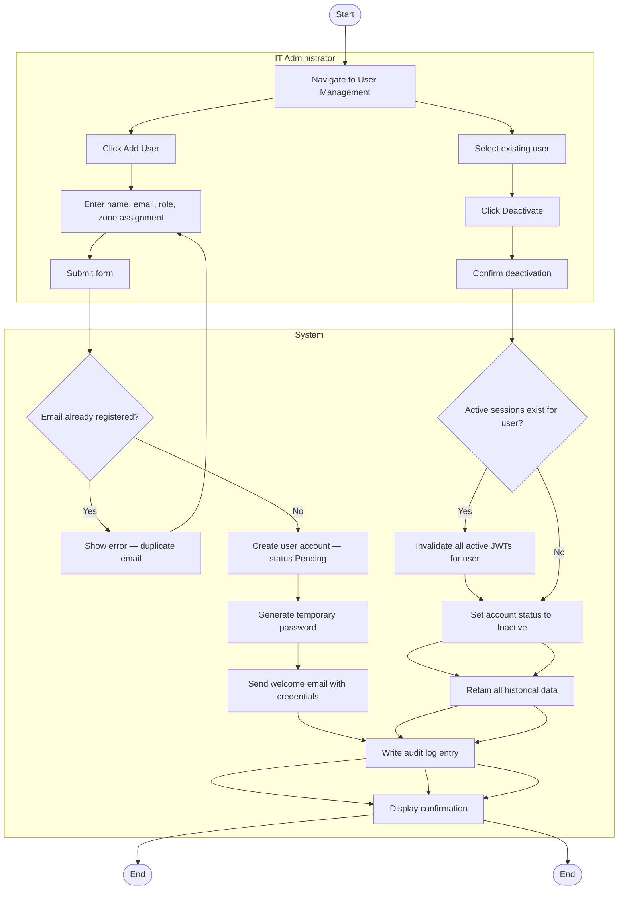
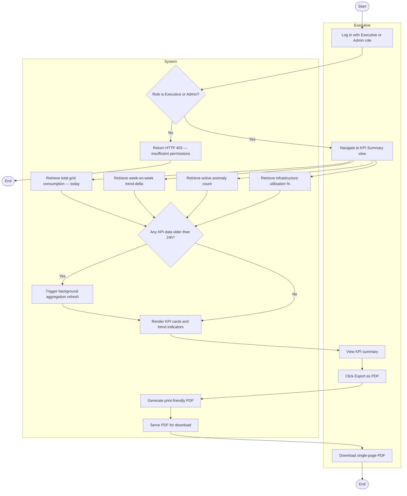

# Activity Diagrams — ElectroView: Electricity Usage Analytics Dashboard

---

## 1. Workflow 1: User Login and Authentication

### Explanation
 
The parallel fork after anomaly record creation (I) shows that the in-app notification (J) and email dispatch (K) happen concurrently, neither blocks the other, and both must complete before the HTTP 201 response is returned to the sender. This parallelism ensures the Electrcity Distribution Manager receives the fastest possible alert while also guaranteeing the email channel is attempted.
 
**Stakeholder concern addressed:** Electrcity Distribution Manager's requirement for proactive, real-time anomaly alerting without manual monitoring. Meter Technician's need for timely fault notification.
 
**Mapped requirements:** FR-02, FR-05. Maps to US-002, UC-04, T-013, T-014, T-015.
 
---

## 3. Workflow 3: Anomaly Resolution

### Explanation
 
Two parallel flows exist after status is set to In Progress: the technician's resolution workflow and the background scheduler's 48-hour escalation check. These run independently, the scheduler does not wait for the technician, and the technician's resolution will supersede escalation if it completes first. The guard on resolution notes (J) prevents incomplete closure, enforcing data quality in the anomaly log.
 
**Stakeholder concern addressed:** Technician's need for structured, trackable fault resolution. Electrcity Distribution Manager's need for assurance that anomalies cannot be silently abandoned.
 
**Mapped requirements:** FR-06. Maps to US-007, UC-05.
 
---

## 4. Workflow 4: Consumer Views Personal Usage Dashboard
 

 
### Explanation
 
The parallel retrieval of current (H) and previous (I) period data runs as sequential steps here but could be parallelised at the API level for performance. The decision node (J) handles the new-consumer edge case where no previous finance period exists, ensuring the UI degrades gracefully. The budget indicator branch (P) shows how US-006 extends this workflow without modifying its core flow.
 
**Stakeholder concern addressed:** Residential Consumer's need for clear, understandable personal usage data and finance period comparison without technical knowledge.
 
**Mapped requirements:** FR-07. Maps to US-005, US-006, UC-06.
 
---

## 5. Workflow 5: Report Generation and Export
 

 
### Explanation
 
The key branching point is the record count guard (G), which routes large reports through an asynchronous background job to avoid blocking the API. Both paths converge at file storage (P), after which the 24-hour expiry lifecycle begins. This satisfies both the performance NFR (inline reports ≤ 10 seconds) and the scalability requirement for large dataset handling.
 
**Stakeholder concern addressed:** Electrcity Network Analyst's need for fast, clean exports. Finance Staff's need for CSV reports compatible with existing financial systems.
 
**Mapped requirements:** FR-08, NFR-P02. Maps to US-004, UC-07.
 
---

## 6. Workflow 6: Zone Threshold Configuration
 

 
### Explanation
 
The parallel fork after persistence (L) shows that storing the audit history (M) and activating the new threshold for live processing (N) happen simultaneously. This is important: the audit log must capture the previous value before the new one takes effect. The threshold applies to all readings received after the save completes, readings already in the database are not retroactively re-evaluated.
 
**Stakeholder concern addressed:** Electrcity Distribution Manager's need to tune detection sensitivity per zone based on infrastructure characteristics and seasonal patterns.
 
**Mapped requirements:** FR-10. Maps to US-002 (detection depends on threshold), UC-09.
 
---

## 7. Workflow 7: User and Meter Account Management
 

 
### Explanation
 
Two parallel sub-workflows are shown: account creation (top path) and deactivation (bottom path), both accessible from the same User Management screen. The deactivation path includes an active session check (M), if the user is currently logged in, their JWT must be invalidated immediately to enforce the deactivation in real time rather than waiting for token expiry.
 
**Stakeholder concern addressed:** IT Administrator's need for auditable, immediate access control management. Security requirement that deactivated users cannot continue using the system through still-valid tokens.
 
**Mapped requirements:** FR-09, NFR-SEC01. Maps to US-008, UC-08.
 
---

## 8. Workflow 8: Executive KPI Dashboard Access
 

 
### Explanation
 
The four KPI data retrieval steps (H, I, J, K) run in parallel, they are independent database queries that do not depend on each other's results. This parallelism is important for meeting the dashboard load time NFR: sequential queries would approximately quadruple the response time compared to concurrent execution. The data freshness check (L) ensures executives never see stale data without being aware of it.
 
**Stakeholder concern addressed:** Municipal Executive's need for self-service strategic data without requiring analyst support. The 24-hour data freshness guard directly maps to the success metric defined in `STAKEHOLDERS.md`.
 
**Mapped requirements:** FR-11, NFR-P01. Maps to US-011, UC-10.
 
---