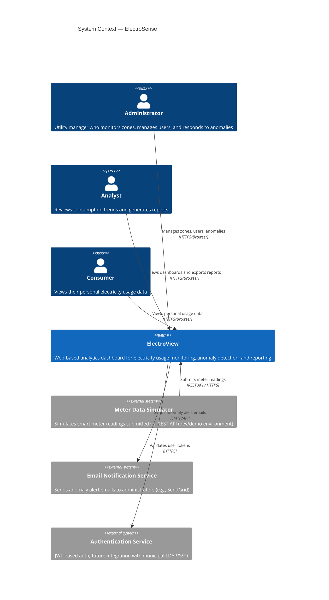
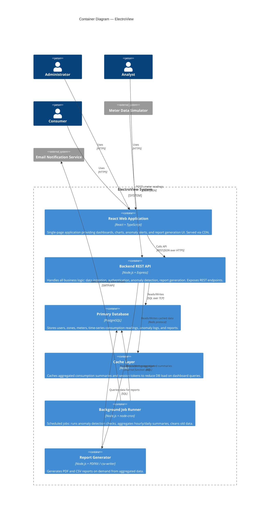
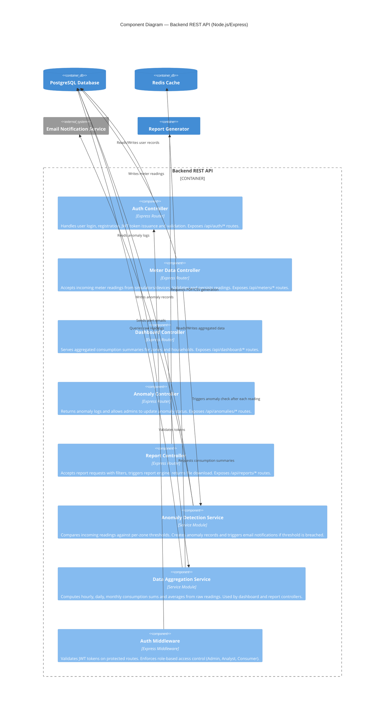
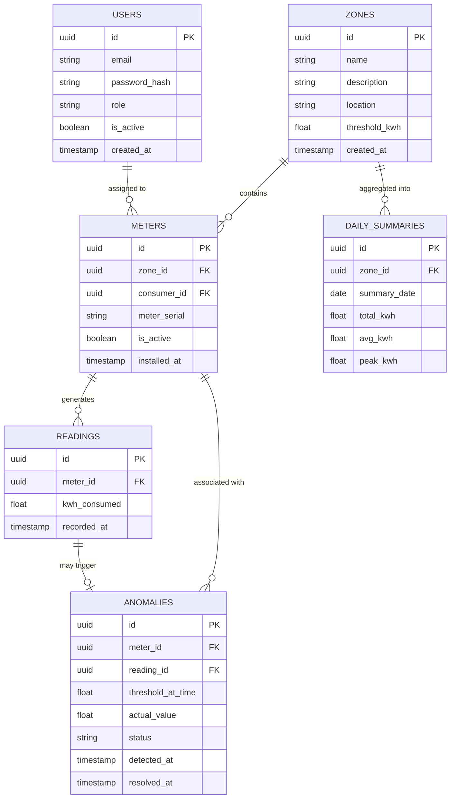
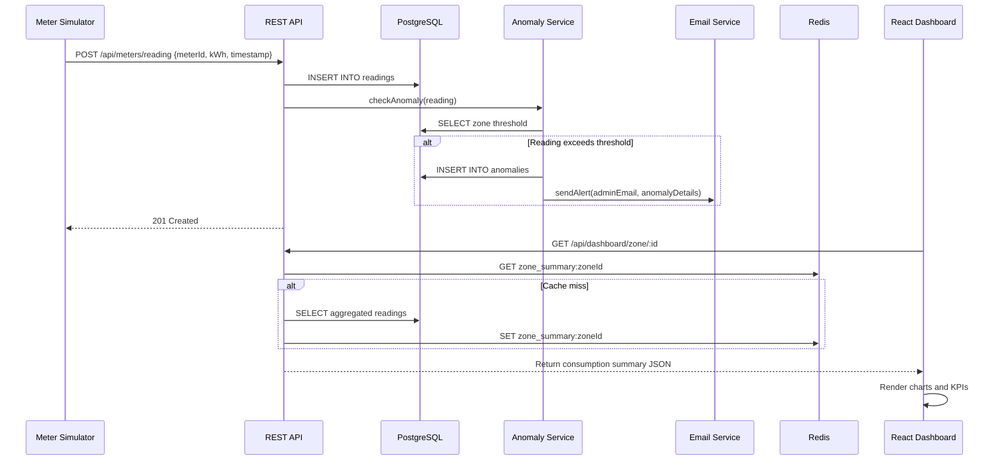
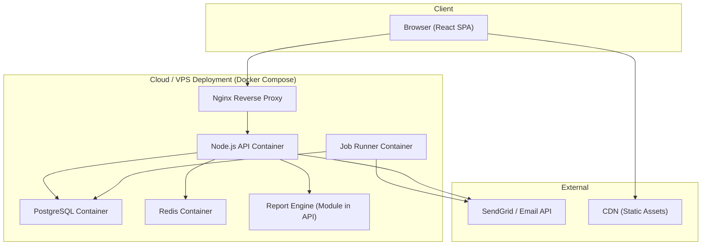

# Architecture — ElectroView: Electricity Usage Analytics Dashboard

## 1. Project Title - ElectroView

## 2. Domain
 
**Domain: Electricity Distribution & Management**
The electrcity distribution and management domain encompasses the generation, distribution, metering, monitoring, and billing of electrical power to residential, commercial, and municipal consumers. In South Africa, electricity distribution is handled by entities such as Eskom and local municipalities which manage large-scale infrastructure including substations, distribution networks, and smart metering systems.
 
This domain is increasingly driven by digital transformation — smart meters, IoT sensors, and SCADA systems generate vast volumes of consumption data that require analytics platforms to derive actionable insights, detect waste or faults, and enable demand-side management.

---
 
## 3. Problem Statement

The problem is that many municipalities in South Africa are struggling to provide uninterrupted electricity to their residents due to infrastructure challenges such as energy dissipation during transmission and distribution, theft and vandalism, meter tampering, and illegal connections.

**ElectroView** addresses these problems by providing a centralised, web-based analytics dashboard that aggregates meter data, visualises consumption trends, detects anomalies, and generates exportable reports enabling both utility managers and consumers to make data-driven decisions.

---

## 4. C4 Architecture Diagrams
 
The C4 model describes software architecture at four levels of abstraction:
- **Level 1 — System Context:** Who uses the system and what external systems does it interact with?
- **Level 2 — Container:** What are the deployable units (apps, databases, services)?
- **Level 3 — Component:** What are the major components inside each container?
- **Level 4 — Code:** Key class/data model detail for the most critical component.
 
---

## 4.1 Level 1 — System Context Diagram
 
> Shows ElectroView in the context of its users and external systems.
 

 
---
 
## 4.2 Level 2 — Container Diagram
 
> Breaks down ElectroView into its deployable containers and their interactions.
 

 
---
 
## 4.3 Level 3 — Component Diagram (Backend REST API)
 
> Breaks down the internal components of the Backend REST API container.
 

 
---
 
## 4.4 Level 4 — Code / Data Model (Core Entities)
 
> Key data model for the most critical persistence layer — the PostgreSQL database schema.
 

 
---
 
## 5. End-to-End System Flow
 
The following sequence illustrates the full data flow from meter reading to dashboard display and anomaly alert.
 

 
---
 
## 6. Deployment Architecture
 
