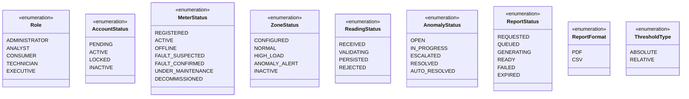

# Class Modeling - ElectroView: Electircity Usage Analytics dashboard

```mermaid
classDiagram
    class Role {
        <<enumeration>>
        ADMINISTRATOR
        ANALYST
        CONSUMER
        TECHNICIAN
        EXECUTIVE
    }
 
    class AccountStatus {
        <<enumeration>>
        PENDING
        ACTIVE
        LOCKED
        INACTIVE
    }
 
    class MeterStatus {
        <<enumeration>>
        REGISTERED
        ACTIVE
        OFFLINE
        FAULT_SUSPECTED
        FAULT_CONFIRMED
        UNDER_MAINTENANCE
        DECOMMISSIONED
    }
 
    class ZoneStatus {
        <<enumeration>>
        CONFIGURED
        NORMAL
        HIGH_LOAD
        ANOMALY_ALERT
        INACTIVE
    }
 
    class ReadingStatus {
        <<enumeration>>
        RECEIVED
        VALIDATING
        PERSISTED
        REJECTED
    }
 
    class AnomalyStatus {
        <<enumeration>>
        OPEN
        IN_PROGRESS
        ESCALATED
        RESOLVED
        AUTO_RESOLVED
    }
 
    class ReportStatus {
        <<enumeration>>
        REQUESTED
        QUEUED
        GENERATING
        READY
        FAILED
        EXPIRED
    }
 
    class ReportFormat {
        <<enumeration>>
        PDF
        CSV
    }
 
    class ThresholdType {
        <<enumeration>>
        ABSOLUTE
        RELATIVE
    }
```
 
---

## 2. Full Class Diagram
 

```mermaid
classDiagram
    %% ─────────────────────────────────────────
    %% Core Classes
    %% ─────────────────────────────────────────
 
    class User {
        -userId : UUID
        -name : String
        -email : String
        -passwordHash : String
        -role : Role
        -status : AccountStatus
        -failedLoginAttempts : Integer
        -createdAt : DateTime
        -lastLoginAt : DateTime
        +login(email, password) Session
        +logout(sessionId) void
        +resetPassword(newPassword) void
        +updateProfile(name, email) void
        +isActive() Boolean
        +isLocked() Boolean
        +incrementFailedAttempts() void
        +lockAccount() void
        +unlockAccount() void
    }
 
    class Session {
        -sessionId : UUID
        -userId : UUID
        -token : String
        -issuedAt : DateTime
        -expiresAt : DateTime
        -refreshExpiresAt : DateTime
        -isRevoked : Boolean
        +isValid() Boolean
        +refresh() Session
        +revoke() void
        +getRole() Role
    }
 
    class Zone {
        -zoneId : UUID
        -name : String
        -description : String
        -location : String
        -capacityKwh : Float
        -thresholdType : ThresholdType
        -thresholdValue : Float
        -status : ZoneStatus
        -createdAt : DateTime
        +activate() void
        +deactivate() void
        +updateThreshold(type, value) void
        +getCurrentLoad() Float
        +getLoadPercentage() Float
        +computeStatus() ZoneStatus
        +getActiveMeters() List~Meter~
    }
 
    class Meter {
        -meterId : UUID
        -serialNumber : String
        -status : MeterStatus
        -installedAt : DateTime
        -lastReadingAt : DateTime
        -consecutiveRejectedReadings : Integer
        -zoneId : UUID
        -consumerId : UUID
        +activate() void
        +deactivate() void
        +decommission() void
        +getLatestReading() Reading
        +isOnline() Boolean
        +isFaultSuspected() Boolean
        +flagOffline() void
        +assignConsumer(consumerId) void
    }
 
    class Reading {
        -readingId : UUID
        -meterId : UUID
        -kwhConsumed : Float
        -recordedAt : DateTime
        -receivedAt : DateTime
        -status : ReadingStatus
        -isAnomaly : Boolean
        +validate() Boolean
        +persist() void
        +checkAgainstThreshold(threshold) Boolean
        +flag() void
        +reject(reason) void
    }
 
    class Anomaly {
        -anomalyId : UUID
        -meterId : UUID
        -readingId : UUID
        -thresholdAtTime : Float
        -actualValue : Float
        -status : AnomalyStatus
        -detectedAt : DateTime
        -assignedTo : UUID
        -resolvedAt : DateTime
        -resolutionNotes : String
        +assign(userId) void
        +escalate() void
        +resolve(notes, userId) void
        +autoResolve() void
        +isOverdue() Boolean
        +getAgeInHours() Integer
        +canResolve() Boolean
    }
 
    class Report {
        -reportId : UUID
        -requestedBy : UUID
        -startDate : Date
        -endDate : Date
        -zoneId : UUID
        -meterId : UUID
        -format : ReportFormat
        -status : ReportStatus
        -requestedAt : DateTime
        -generatedAt : DateTime
        -expiresAt : DateTime
        -filePath : String
        +validate() Boolean
        +generate() void
        +export() File
        +isExpired() Boolean
        +purge() void
        +requiresBackgroundProcessing() Boolean
    }
 
    class DailySummary {
        -summaryId : UUID
        -zoneId : UUID
        -summaryDate : Date
        -totalKwh : Float
        -avgKwh : Float
        -peakKwh : Float
        -meterCount : Integer
        -computedAt : DateTime
        +compute(zoneId, date) void
        +recompute() void
        +isStale() Boolean
    }
 
    class AuditLog {
        -logId : UUID
        -actorId : UUID
        -entityType : String
        -entityId : UUID
        -action : String
        -previousValue : String
        -newValue : String
        -performedAt : DateTime
        +record(actor, entity, action, prev, next) void
        +getLogsForEntity(entityId) List~AuditLog~
    }
 
    class Notification {
        -notificationId : UUID
        -recipientId : UUID
        -type : String
        -message : String
        -referenceId : UUID
        -isRead : Boolean
        -createdAt : DateTime
        +markAsRead() void
        +send() void
        +dismiss() void
    }
 
    %% ─────────────────────────────────────────
    %% Services (boundary classes)
    %% ─────────────────────────────────────────
 
    class AnomalyDetectionService {
        -thresholdCache : Map
        +checkReading(reading, zone) Boolean
        +createAnomaly(reading, threshold) Anomaly
        +dispatchAlert(anomaly) void
        +scheduleEscalationCheck(anomalyId) void
    }
 
    class ReportGenerationService {
        +buildQuery(report) Query
        +aggregateData(query) DataSet
        +renderPDF(data) File
        +renderCSV(data) File
        +storeFile(file, reportId) String
    }
 
    class AuthService {
        +authenticate(email, password) Session
        +validateToken(token) Boolean
        +issueJWT(user) String
        +revokeToken(sessionId) void
        +enforceRateLimit(ip) Boolean
    }
 
    %% ─────────────────────────────────────────
    %% Relationships
    %% ─────────────────────────────────────────
 
    %% User relationships
    User "1" --> "0..*" Session : has
    User "1" --> "0..1" Meter : linked as consumer
    User "1" --> "0..*" Report : requests
    User "1" --> "0..*" Anomaly : resolves
    User "1" --> "0..*" AuditLog : generates
    User "1" --> "0..*" Notification : receives
 
    %% Zone relationships
    Zone "1" *-- "1..*" Meter : contains
    Zone "1" --> "0..*" DailySummary : aggregated into
    Zone "1" --> "0..*" Anomaly : has
 
    %% Meter relationships
    Meter "1" --> "0..*" Reading : generates
    Meter "1" --> "0..*" Anomaly : associated with
 
    %% Reading relationships
    Reading "1" --> "0..1" Anomaly : may produce
 
    %% Report relationships
    Report "0..*" --> "0..1" Zone : scoped to
    Report "0..*" --> "0..1" Meter : scoped to
 
    %% Service relationships
    AnomalyDetectionService --> Reading : processes
    AnomalyDetectionService --> Anomaly : creates
    AnomalyDetectionService --> Notification : dispatches
    ReportGenerationService --> Report : generates
    ReportGenerationService --> DailySummary : queries
    AuthService --> User : authenticates
    AuthService --> Session : manages
```
 
---