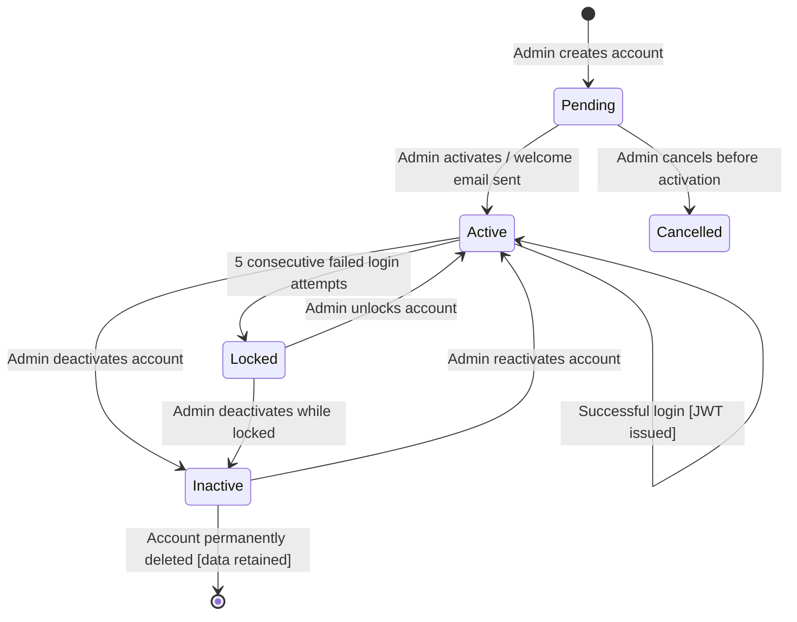
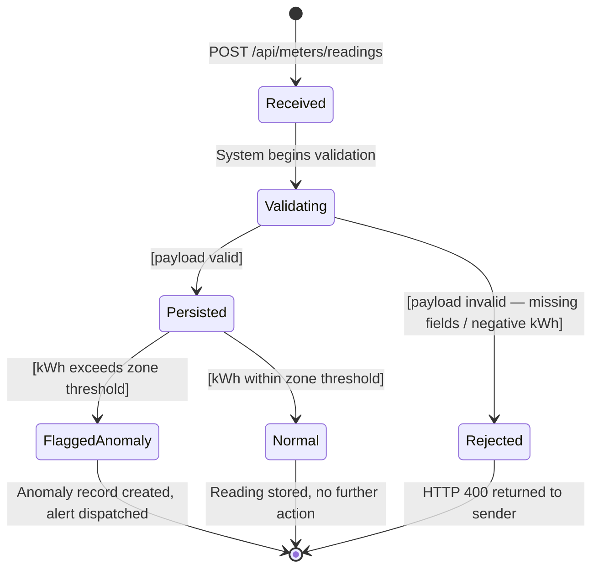
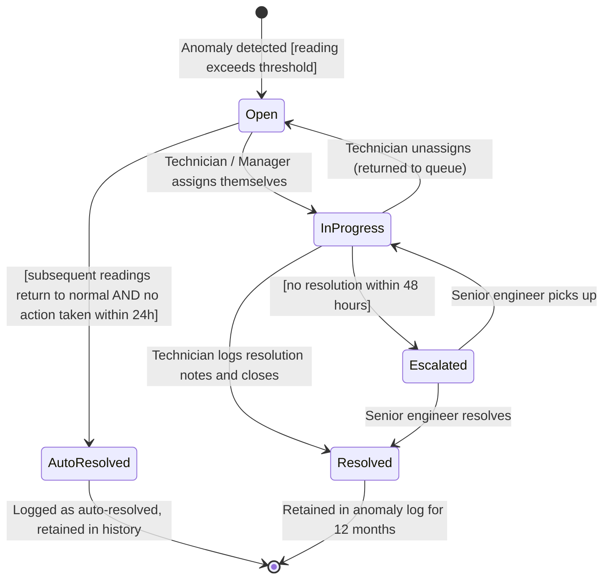
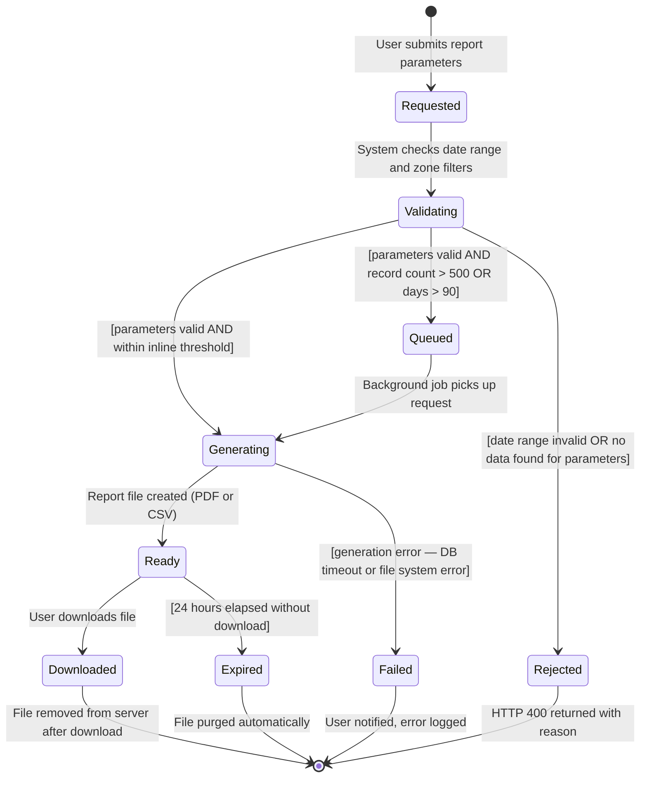
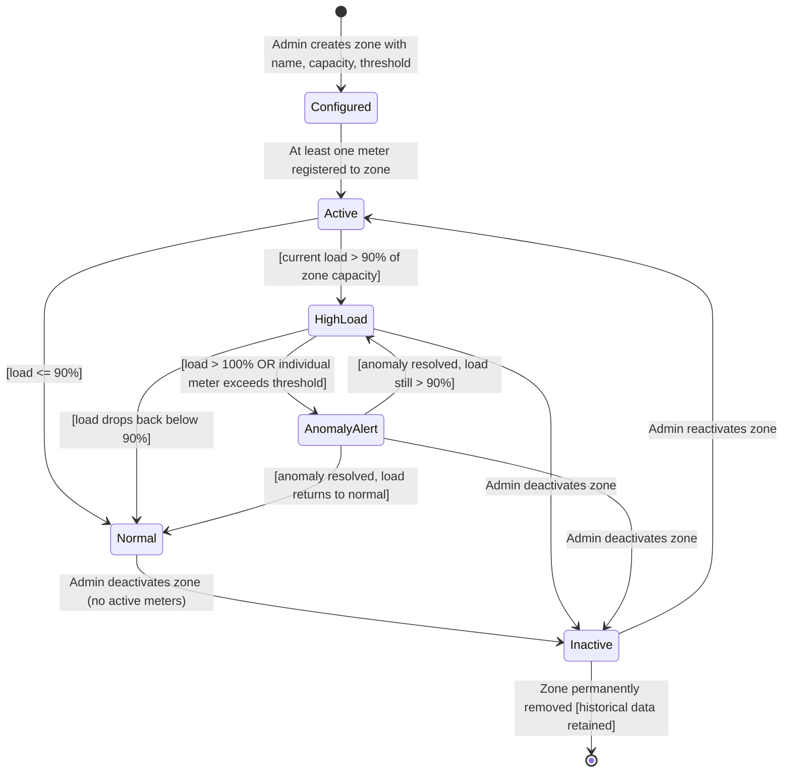
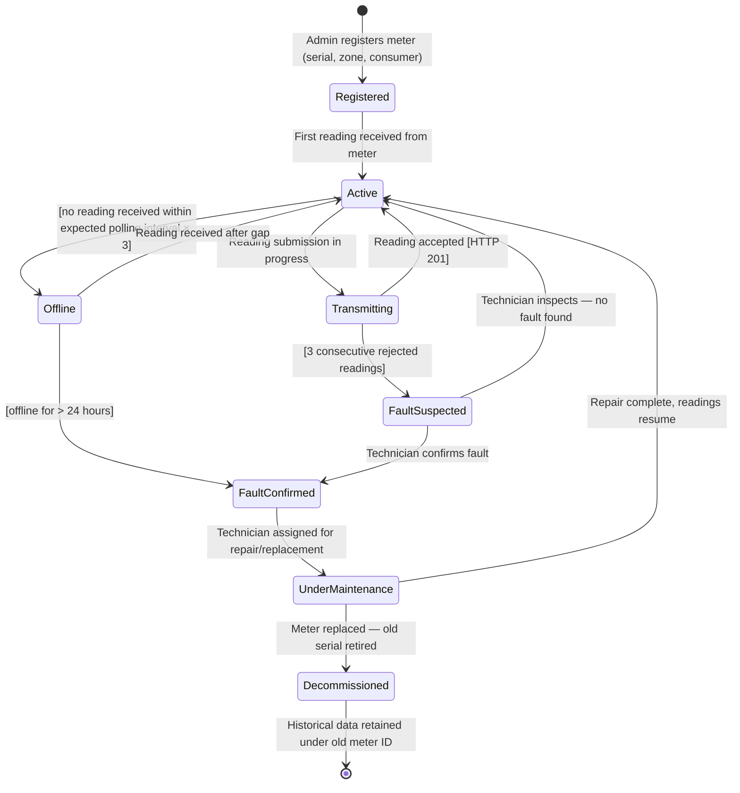
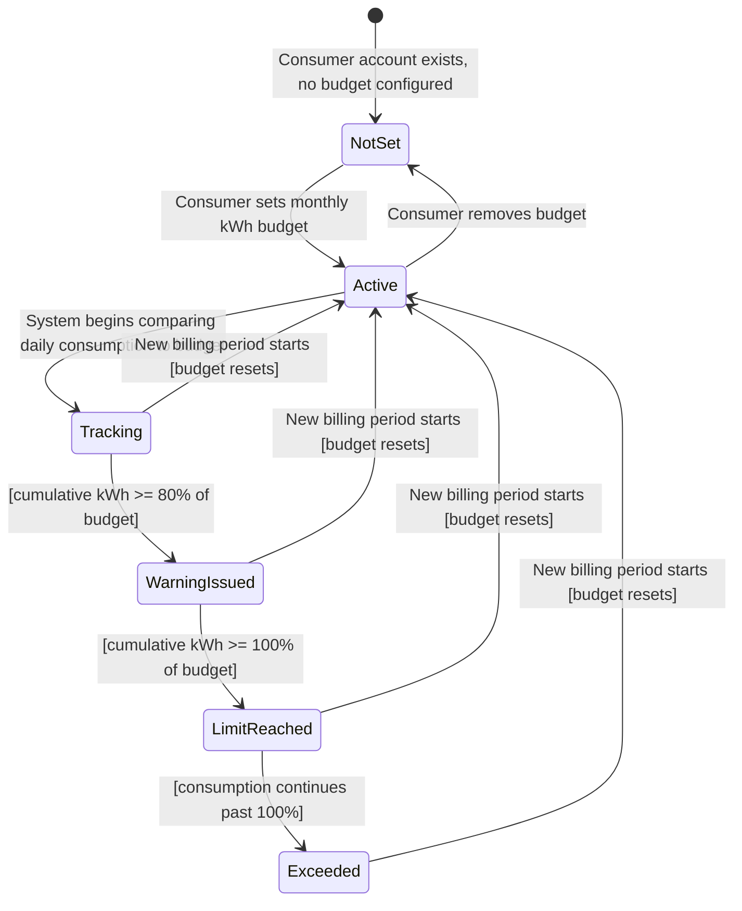
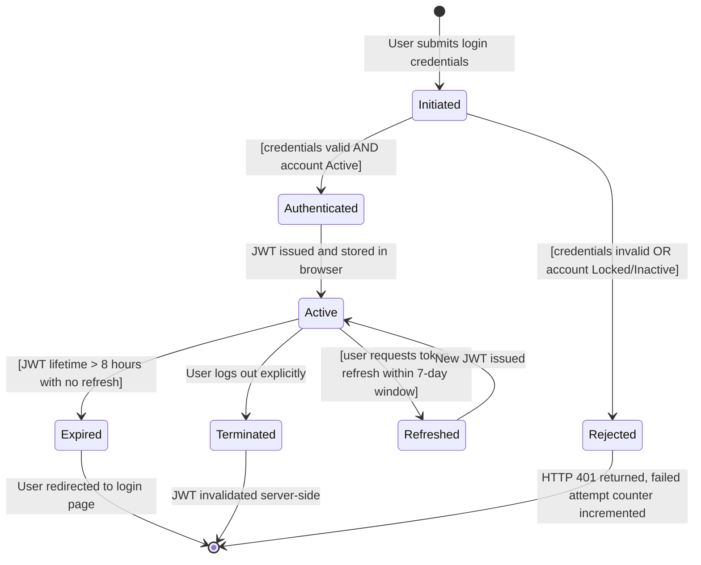

# State Diagrams — ElectroView: Electricity Usage Analytics Dashboard

---

## 1. Object 1: User Account

### Explanation
 
**Key states:** A User Account begins in `Pending` when first created by an administrator and transitions to `Active` once the admin confirms activation and a welcome email is dispatched. The `Locked` state is entered automatically after 5 consecutive failed login attempts — a security guard condition enforced without human intervention. `Inactive` accounts exist when an admin deactivates a user; the account cannot be logged into but all historical data is retained.
 
**Key transitions:** The transition from `Active` to `Locked` has an implicit guard: `[failedAttempts >= 5]`. The transition from `Inactive` back to `Active` requires explicit admin action, preventing accidental reactivation.
 
**Mapped requirements:** FR-01 (authentication and RBAC), FR-09 (user management), NFR-SEC03 (rate limiting and lockout). Maps to US-008 and US-012.
 
---

## 2. Object 2: Meter Reading

### Explanation
 
**Key states:** Every meter reading submitted to the ingestion API passes through `Validating` before it can be persisted. The guard condition `[payload invalid]` causes immediate rejection with an HTTP 400 response. Once persisted, a second guard `[kWh exceeds zone threshold]` determines whether the reading moves to `FlaggedAnomaly`, triggering the anomaly detection pipeline, or `Normal`, where it is simply stored.
 
**Key transitions:** The branching at `Persisted` is the system's core anomaly detection decision point. Both terminal paths end the reading's active lifecycle — it becomes a historical record.
 
**Mapped requirements:** FR-02 (meter reading ingestion), FR-05 (anomaly detection). Maps to US-002, T-013, T-014.
 
---

## 3. Object 3: Anomaly

### Explanation
 
**Key states:** An anomaly is created in `Open` state the moment a flagged reading is detected. `InProgress` represents active field or remote investigation. `Escalated` is a guard-conditioned transition that fires if no resolution occurs within 48 hours, ensuring anomalies cannot be silently abandoned. `AutoResolved` handles the case where consumption normalises before a technician intervenes.
 
**Key transitions:** The transition from `InProgress` to `Escalated` has the guard `[resolutionTime > 48h]`. Resolution requires explicit note entry — the system does not permit a status change to `Resolved` without a non-empty resolution note field.
 
**Mapped requirements:** FR-05 (anomaly detection), FR-06 (anomaly resolution workflow). Maps to US-002, US-007, T-015.
 
---

## 4. Object 4: Consumtion Report

### Explanation
 
**Key states:** The `Queued` state handles the large-report scenario, reports covering more than 500 meters or 90 days are processed asynchronously so they do not block the API. `Ready` is a time-bounded state: files that are not downloaded within 24 hours move to `Expired` and are purged from the server to manage storage.
 
**Key transitions:** The branching at `Validating` is governed by two sequential guards: first whether the parameters are valid, then whether the report size falls within the inline processing threshold.
 
**Mapped requirements:** FR-08 (report generation), NFR-P02 (report performance). Maps to US-004, T-020.
 
---

## 5. Object 5: Zone
 

 
### Explanation
 
**Key states:** A Zone's operational states;  `Normal`, `HighLoad`, and `AnomalyAlert` correspond directly to the colour-coded status indicators on the Zone Dashboard. These states are computed continuously from incoming meter readings and are not manually set. `Inactive` is the only manually-assigned state.
 
**Key transitions:** The transition from `Active` to `HighLoad` is triggered automatically when aggregated consumption crosses 90% of the zone's configured capacity. This threshold is configurable per zone (FR-10), so the guard condition references the stored threshold value rather than a hardcoded number.
 
**Mapped requirements:** FR-03 (zone dashboard), FR-10 (threshold configuration). Maps to US-001, US-002.
 
---
## 6. Object 6: Smart Meter
 

 
### Explanation
 
**Key states:** The meter lifecycle captures both software-visible states (`Transmitting`, `Offline`) and physical states (`FaultConfirmed`, `UnderMaintenance`, `Decommissioned`). The `FaultSuspected` state acts as a buffer between transient errors and confirmed hardware failures, preventing unnecessary field dispatches.
 
**Key transitions:** The transition to `Offline` is time-based, if the polling interval (e.g., every 15 minutes) passes three times without a reading, the meter is flagged offline. `FaultConfirmed` can be reached either through prolonged offline status or through technician inspection following rejected readings.
 
**Mapped requirements:** FR-02 (meter ingestion), FR-06 (anomaly resolution), FR-09 (meter management). Maps to US-007, US-008.
 
---
 
## 7. Object 7: Consumer Usage Budget
 

 
### Explanation
 
**Key states:** The budget object has a progressive alert lifecycle, `WarningIssued` at 80% and `LimitReached` at 100%, giving consumers two notification touchpoints before they exceed their target. `Exceeded` captures the state where consumption continues past the budget limit within the same billing period, distinguishing it from `LimitReached` which is the exact threshold crossing.
 
**Key transitions:** All transitions back to `Active` at the start of a new billing period are system-triggered (automated monthly reset). The transition from `NotSet` to `Active` is the only consumer-initiated transition.
 
**Mapped requirements:** FR-07 (consumer usage view and budget). Maps to US-006.
 
---
 
## 8. Object 8: User Session
 

 
### Explanation
 
**Key states:** The session object is distinct from the User Account, a single account can have multiple sessions (e.g., browser and mobile). `Active` represents a valid, unexpired JWT in use. The `Refreshed` state handles the sliding window renewal, allowing long-running sessions to persist without forcing re-login every 8 hours as long as the user remains active within the 7-day refresh window.
 
**Key transitions:** The guard on `Authenticated` checks both credential validity and account status, a valid password on a `Locked` account still results in `Rejected`. Explicit logout (`Terminated`) invalidates the JWT server-side via a blocklist, preventing token reuse after logout.
 
**Mapped requirements:** FR-01 (authentication and RBAC), NFR-SEC01 (TLS), NFR-SEC02 (password hashing). Maps to US-012, T-001 through T-004.
 
---