# UseCases.md — ElectroView: Electircity Usage Analytics dashboard

---

```mermaid
graph TD
    %% Actors
    EDM([Electrcity Distribution Manager])
    ENA([Electrcity Network Analyst])
    C([Consumer])
    IT([IT Administrator])
    FS([Finance Staff])
    ET([Electrcity Technician])
    ME([Municipal Executive])
    SYS([System / Scheduler])
 
    %% Use Cases
    UC1[UC-01: Login and Authenticate]
    UC2[UC-02: View Zone Dashboard]
    UC3[UC-03: View Historical Trends]
    UC4[UC-04: Detect and Alert Anomaly]
    UC5[UC-05: Manage Anomaly Resolution]
    UC6[UC-06: View Personal Usage]
    UC7[UC-07: Generate and Export Report]
    UC8[UC-08: Manage Users and Meters]
    UC9[UC-09: Configure Zone Thresholds]
    UC10[UC-10: View Executive KPI Summary]
    UC11[UC-11: Import Bulk Meter Data]
    UC12[UC-12: Set Personal Usage Budget]
 
    %% Inclusions (dashed style via subgraph label)
    UC2 -->|includes| UC1
    UC3 -->|includes| UC1
    UC4 -->|includes| UC1
    UC5 -->|includes| UC1
    UC6 -->|includes| UC1
    UC7 -->|includes| UC1
    UC8 -->|includes| UC1
    UC9 -->|includes| UC1
    UC10 -->|includes| UC1
    UC11 -->|includes| UC1
    UC12 -->|includes| UC1
 
    UC4 -->|includes| UC9
 
    %% Actor associations
    EDM --- UC2
    EDM --- UC3
    EDM --- UC5
    EDM --- UC9
 
    ENA --- UC3
    ENA --- UC7
    ENA --- UC11
 
    C --- UC6
    C --- UC12
 
    IT --- UC8
    IT --- UC11
 
    BS --- UC7
 
    ET --- UC5
 
    ME --- UC10
 
    SYS --- UC4
```

## 2. Actor and Use Case Descriptions
 
### 2.1 Actors
 
| Actor | Type | Role |
|---|---|---|
| Electrcity Distribution Manager | Primary | Monitors zone-level consumption and load in real time; responds to operational alerts. Maps to FR-03, FR-05, FR-09, FR-10. |
| Electrcity Network Analyst | Primary | Analyses historical trends, produces consumption reports, and imports historical data. Maps to FR-04, FR-08, FR-12. |
| Consumer | Primary | Views their own meter's usage history and manages their personal budget alert. Maps to FR-07. |
| IT Administrator | Primary | Manages user accounts, meter records, and bulk data imports. Maps to FR-09, FR-12. |
| Finance Staff | Primary | Generates and exports consumption reports for billing reconciliation. Maps to FR-08. |
| Electrcity Technician | Primary | Reviews and resolves anomalies identified in the field. Maps to FR-06. |
| Municipal Executive | Primary | Views high-level KPI summaries for strategic reporting. Maps to FR-11. |
| System / Scheduler | Secondary | Automated actor; triggers anomaly detection after each meter reading ingestion. Maps to FR-05. |

---

### 2.2 Key Relationships
 
**Include relationships:** Every use case that requires an authenticated session includes UC-01 (Login and Authenticate). This avoids repeating authentication logic in each specification and reflects the system's JWT enforcement on all protected endpoints (FR-01). UC-04 (Detect and Alert Anomaly) additionally includes UC-09 (Configure Zone Thresholds) because anomaly detection cannot execute without a threshold value being present.
 
**Actor generalisations:** The Electrcity Distribution Manager and Electrcity Network Analyst share access to UC-03 (View Historical Trends) — both roles require trend data, though for different purposes (operational monitoring vs. analytical reporting). Rather than duplicating the use case, both actors are associated with the same use case, with role-specific filtering applied within the system.
 
**Secondary actor (System / Scheduler):** UC-04 is initiated not by a human actor but by the system itself upon ingestion of each meter reading. This models the automated nature of anomaly detection, which operates continuously in the background without requiring manual user intervention.

---

### 2.3 Alignment with Stakeholder Concerns
 
| Stakeholder Concern | Addressed by Use Case |
|---|---|
| Electrcity Distribution Manager: real-time visibility into zone load | UC-02: View Zone Dashboard |
| Electrcity Distribution Manager: proactive fault detection | UC-04: Detect and Alert Anomaly |
| Electrcity Network Analyst: historical trend analysis | UC-03: View Historical Trends |
| Electrcity Network Analyst: report generation and export | UC-07: Generate and Export Report |
| Consumer: personal usage visibility | UC-06: View Personal Usage |
| Residential Consumer: budget management | UC-12: Set Personal Usage Budget |
| Finance Staff: meter-level data for reconciliation | UC-07: Generate and Export Report |
| Electrcity Technician: structured anomaly resolution | UC-05: Manage Anomaly Resolution |
| IT Admin: user and meter account management | UC-08: Manage Users and Meters |
| Municipal Executive: self-service KPI access | UC-10: View Executive KPI Summary |
 
---